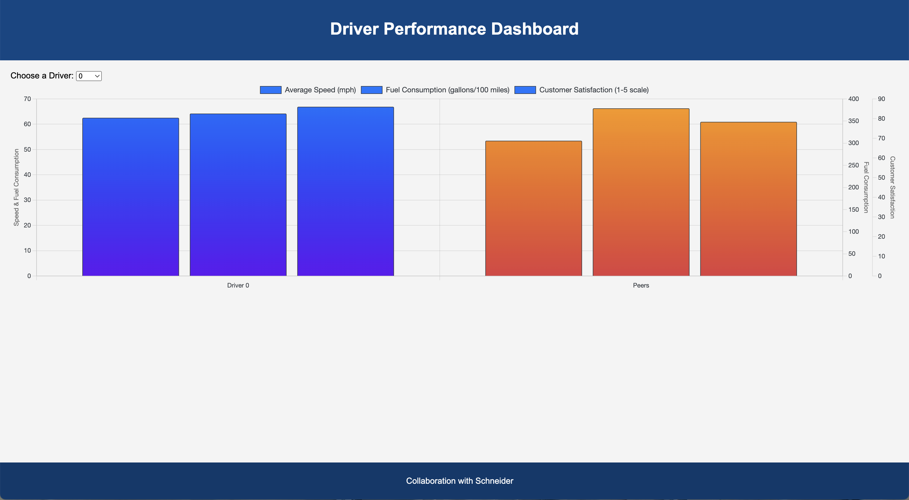

# Driver Performance Visualization Tool

This project is focused on enhancing the visualization of driver performance metrics by comparing a current driver's performance against their peers. Our goal is to create visually appealing and insightful graphs that highlight discrepancies in performance and provide clear guidance on areas of improvement.

## Getting Started

To view the project, ensure you have `npm` installed on your machine. We use a simple HTTP server to serve our visualization tool. To run the project, follow these steps:

1. Open your terminal.
2. Navigate to the project directory.
3. Run the command `http-server`.

This will start a local web server. Open your browser and go to the address provided in the terminal output (usually `http://localhost:8080`) to view the project.

## Features

The current implementation includes a comparative graph that showcases the performance of a selected driver against the average metrics of their peers. The visual distinction and detailed metrics aim to provide clear insights into the performance gaps.

### Current Graph Overview

The graph currently utilizes a dual Y-axis format to represent different scales of measurement, allowing for a comprehensive comparison of performance metrics such as speed, fuel efficiency, and safety scores.

## TODOs

- **Change the Chart**: The current chart configuration with three Y-axes can be complex to interpret. We plan to redesign the chart to simplify the visualization while retaining the depth of comparison.
  
- **Write an Explanation for the Chart (Analysis)**: An in-depth analysis will be added to accompany the chart. This will include interpretations of the data, key insights into performance discrepancies, and actionable recommendations for improvement.
  
- **Discuss the Style and Current Progress**: We are in the process of refining the visual aesthetics of our graphs to make them more engaging and easier to understand. Feedback on style and suggestions for improvement are welcomed.

<!-- ## Contributors

Your contributions are welcome! If you have suggestions for how we can improve the visualization tool or wish to contribute to the development, please feel free to submit a pull request or open an issue. -->

## License

This project is licensed under the MIT License - see the LICENSE.md file for details.
